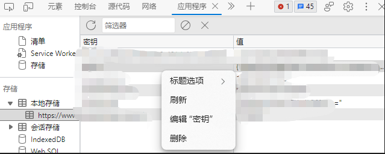

# 介绍

产生背景
- 最近在学习dama理论，囿于无试题练手，遂到处找资源，索到xx宝有比较多的题库分享，但仅限于在线刷题，不提供试题下载
- 初看网络请求，比较规范，但核心的试题列表均返回密文，无法直接复用，调试跟进js解密过程，判断为标准的非对称3次加密算法(TripleDES)，初具可行性

本扩展适用于edge/chrome，主要目的是批量解密并生成xx宝试题库，便于线下学习交流使用，不做任何商业用途。

最终生成的试题效果如下
 

# 原理介绍

使用[浏览器扩展程序包](https://learn.microsoft.com/zh-cn/microsoft-edge/extensions-chromium/developer-guide/devtools-extension)提供的网络请求拦截与定制逻辑注入能力，借助[cryptojs](https://cryptojs.gitbook.io/docs/)组件库对内容解密，对json解析生成html试题集。

主要步骤如下：
1. 捕获客户端用于解密的密钥
2. 拦截请求试题列表的接口，并使用密钥对返回结果解密，得到json格式的试题列表
3. 解析json，并在开发者工具的定制panel中展示

# 使用方式

前置步骤
1. 将此扩展添加到浏览器扩展中
2. 拥有某宝账户并登录主站(可选)

确认以上信息后按照以下步骤使用本扩展

1. F12打开开发者工具，选择名为`Decryptor`的tab
 
2. 刷新页面，开始请求试题库，一般是10题一次请求，所以依次选择第1题，第11题，第21题，以让此扩展逐步加载题库内容
3. 达到自己想要的题库数量后，保存题库内容，因开发者工具里的tab不允许打印和保存最新内容，按照下述方式保存题库
   - 右键`Decryptor`页面，选择`检查`以调出新的开发者工具窗口
    
   - 找到tab对应的`iframe`，在`html`这个元素上右键选择`复制元素`
    
   - 创建一个空白文档，将复制的内容粘贴进去，保存为html文件
   - 用浏览器打开这个html文档，显示的就是题库内容
   - 打印可选择`添加页眉页脚`显示页码方便查阅 ，由于内容字体较大可视个人习惯选择缩放，比如80%打印
    

# Q&A

> 1. 刷新页面显示`malformed-utf8`错误

可能是加密key错误或者本地保存的和最新的不一致，通过清除题库站点的本地存储强制题库自动刷新加密key
- 打开开发者工具，切换到`应用程序`
 
- 进入题库站点的本地存储，右键逐个删除
 
- 重新刷新页面，页面报错继续再刷一次

# TODO

- [ ] 自动填充请求试题列表id，减少频繁的手动触发操作
- [ ] 自动生成本地文件，方便修改打印
- [ ] 自动缓存已请求的参数列表或者试题信息，支持中断后自动跳过已请求的数据
- [ ] 打印模式自动带上标题与页码
- [ ] 重新梳理代码结构